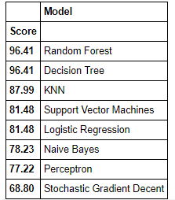

# Machine-Learning-from-disaster-on-Titanic-dataset
## Table of Contents
<!-- AUTO-GENERATED-CONTENT:START (TOC:collapse=true&collapseText="Click to expand") -->

click to expand

 
- [Tools Utilized](#Tools-Utilized)  
- [Dataset Information](#Dataset-Information)  
- [Purpose](#Purpose)  
- [Conclusion](#Conclusion)  

<!-- AUTO-GENERATED-CONTENT:END -->

## Tools Utilized
These are the tools I have utilized for the following project:
* Google Colab
* Python
### Python Libraries 
* NumPy
* Matplotlib
* Pandas
* RegEx
* Seaborn
* Scikit-learn

**TO RUN THE CODE, DOWNLOAD THE PYTHON FILE AND USE PyScripter, PyDev, PyCharm, Google Colab or any other tools supported to open the .ipynb file**
 
Used Machine Learning algorithms like Decision Trees, Guassian Naive Bayes, K Nearest Neighbor, Linear Support Vector Machine, Logistic Regression, Random Forest,and Stochastic Gradient Descent(SGD) to create predictive models and interpret them. Found a significant relation for each algorithm in the data to create multivariate models.

## Dataset Information

**Data Set Name:** 'Titanic: Machine Learning from Disaster'    [`link to Kaggle Dataset`](https://github.com/priyankabandekar31/Machine-Learning-from-disaster-on-Titanic-dataset/blob/main/Titanic_Machine_Learning_from_Disaster.ipynb) which contains information on who was more likely to survive based based on social categories such as age, gender, and social economic class. 

**Source:**  Kaggle from Kaggle Competitions

## Purpose

**Abstract :** The sinking of the Titanic is one of the most infamous shipwrecks in history.  On April 15, 1912, during her maiden voyage, the widely considered “unsinkable” RMS Titanic sank after colliding with an iceberg. Unfortunately, there weren’t enough lifeboats for everyone onboard, resulting in the death of 1502 out of 2224 passengers and crew.  While there was some element of luck involved in surviving, it seems some groups of people were more likely to survive than others.  In this Kaggle challenge, we are asked to build a predictive model which will answer the question: "What sorts of people are more likely to survive?" using the passenger data such as name,age,gender,socio-economic class etc.

**Aim** : To identify and predict from the past data of who is more likely to survive on the titanic by utilizing machine learning algorithms.

## Conclusion
A Random Forest Classifer leads with 96% accuracy

